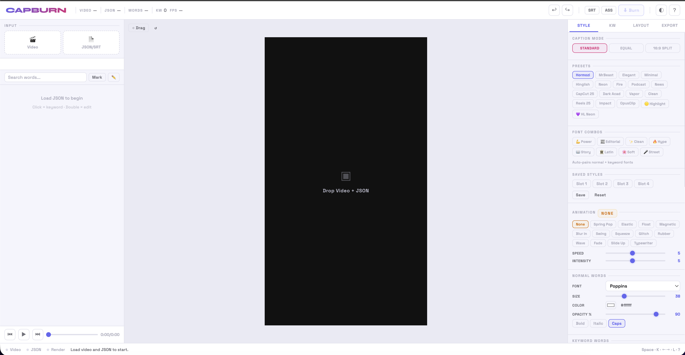
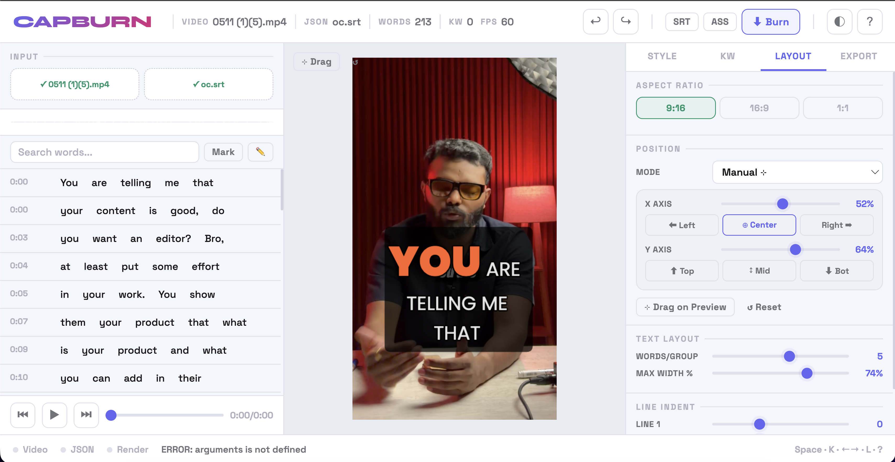
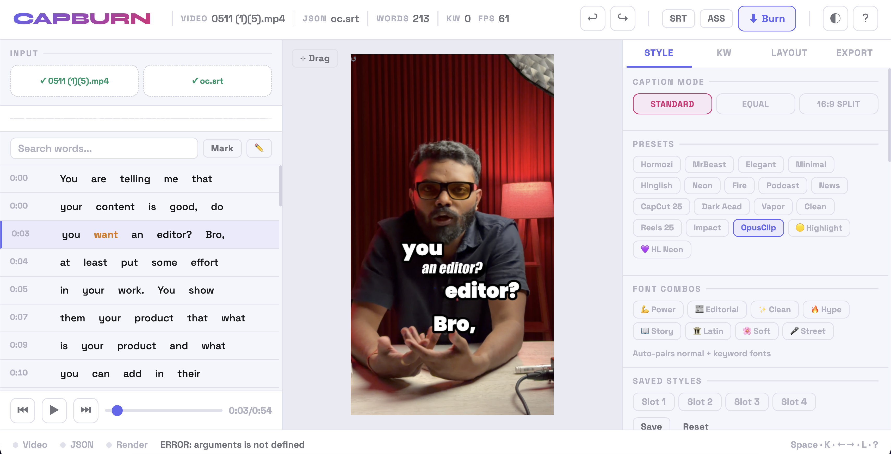

# CAPBURN

**Burn styled captions into reels and videos. Locally. No subscriptions.**

Built for Hinglish creators — word-level keyword highlighting, GSAP animations, 16 presets, full typography control. Runs entirely on your machine.

  

---

## What it does

You bring a **video** and a **Whisper JSON** (word-level timestamps). CAPBURN gives you a visual editor to style every word, mark keywords, preview in real time, then burn captions directly into the video — no quality loss.

```
Whisper JSON  ──►  CAPBURN editor  ──►  captioned video
```



---

## Features

**Typography**
- 16 caption fonts — Poppins, Bebas Neue, Playfair Display, Oswald, Syne, Archivo Black, Righteous, Pacifico and more
- 8 auto font combos — Power, Editorial, Clean, Hype, Story, Latin, Soft, Street
- Separate font, size, color, bold/italic/caps for normal words vs keywords vs active word
- 4 independent spacing controls — normal→normal, normal→keyword, keyword→normal, line gap (all go negative for tight kerning)

**Animation (GSAP powered)**
- 14 animations — Spring Pop, Elastic, Float, Magnetic, Blur In, Swing, Squeeze, Glitch, Rubber Band, Wave, Fade, Slide Up, Typewriter, None
- Speed + Intensity controls per animation
- Smooth 60fps preview — GSAP spring physics, not janky canvas loops

**Presets**
- 18 presets — Hormozi, MrBeast, Elegant, Minimal, Hinglish, Neon, Fire, Podcast, Newspaper, CapCut 25, Dark Academia, Vaporwave, Clean, Reels 25, Impact, OpusClip, 🟡 Highlight, 💜 HL Neon
- Highlight mode — draws a colored pill box behind active/keyword words (think Submagic/OpusClip style)
- 4 save slots — save your custom style, reload across sessions

**Caption modes**
- Standard — keyword words bigger + different font/color
- Equal size — all words same size, active word color-pops only
- 16:9 Split — talking head layout, captions split left and right of speaker zone

**Layout**
- 9:16 (reels), 16:9 (YouTube), 1:1 (square)
- Manual X/Y position with sliders + quick buttons (Left/Center/Right, Top/Mid/Bot)
- Drag handle on preview canvas
- Line indent per line (line 1, 2, 3 separately)
- Max width control

**Word editing**
- Click any word → toggle keyword
- Double-click → edit word text + timestamps
- Add missing words inline
- Search + mark all matching words as keywords
- Auto-detect keywords by frequency
- Import/export keyword lists

**Export**
- Canvas frames method — renders every frame pixel-perfect, guaranteed captions, works with all animations
- ASS subtitle method — faster, no animations, for simple styles
- Quality: Lossless (CRF 0) / High / Balanced / Small
- Audio always copied bit-perfect unless you choose to re-encode
- Download SRT, styled ASS, or tagged JSON alongside video

---

## Setup

**Requirements:** Node.js 18+, a Whisper JSON with word-level timestamps

```bash
git clone https://github.com/YOUR_USERNAME/capburn.git
cd capburn
npm install
node server.js
```

Open **http://localhost:3000**

To use a different port:
```bash
PORT=3001 node server.js
```

> **Why a server?** FFmpeg.wasm requires `SharedArrayBuffer`, which needs specific HTTP headers (`COOP` + `COEP`). The Express server sets these. Opening `index.html` directly in a browser won't work.

---

## Getting the Whisper JSON

Run [OpenAI Whisper](https://github.com/openai/whisper) with word timestamps:

```python
import whisper, json

model = whisper.load_model("large-v3")
result = model.transcribe("your_video.mp4", word_timestamps=True, language="hi")

with open("captions.json", "w") as f:
    json.dump(result, f, ensure_ascii=False, indent=2)
```

Or use the Colab notebook (GPU accelerated, free):

```
Upload video → Whisper large-v3 → download captions.json
```

CAPBURN also accepts `.srt` files directly if you already have those.

---

## Workflow

```
1.  node server.js          → open localhost:3000
2.  Drop video              → preview loads
3.  Drop captions.json      → words appear in list
4.  Pick a preset           → instant style
5.  Click words             → toggle keywords (bigger + colored)
6.  Adjust typography       → live preview updates
7.  Pick animation          → see it in real time
8.  Set position            → drag handle or XY sliders
9.  Hit BURN                → FFmpeg.wasm renders + downloads
```

---

## Keyboard shortcuts

| Key | Action |
|-----|--------|
| `Space` | Play / Pause |
| `← →` | Prev / Next caption group |
| `K` | Toggle keyword on active word |
| `E` | Edit active word |
| `L` | Toggle light / dark mode |
| `Ctrl+Z` | Undo |
| `Ctrl+Y` | Redo |
| `Ctrl+E` | Export video |
| `Ctrl+S` | Export SRT |
| `?` | Show shortcuts |

---

## Project structure

```
capburn/
├── server.js          # Express server (COOP/COEP headers for FFmpeg.wasm)
├── package.json
├── public/
│   ├── index.html     # Entire app — UI + renderer + export logic
│   └── ffmpeg/        # FFmpeg.wasm binaries (installed via npm)
│       ├── ffmpeg.js
│       ├── 814.ffmpeg.js
│       ├── ffmpeg-core.js
│       └── ffmpeg-core.wasm
```

Everything runs client-side except the static file serving. No database, no cloud, no API keys.

---

## Stack

| Layer | Tech |
|-------|------|
| Server | Node.js + Express |
| Rendering | HTML5 Canvas 2D |
| Animations | [GSAP 3](https://gsap.com) |
| Video burn | [FFmpeg.wasm](https://ffmpegwasm.netlify.app) |
| Fonts | Google Fonts |
| Transcription | OpenAI Whisper (external) |

---

## Roadmap

- [ ] Python backend for GPU-accelerated export (10× faster)
- [ ] Built-in Whisper transcription (no separate Colab step)
- [ ] Batch processing multiple videos
- [ ] Remotion export for spring-physics animations in final video
- [ ] Per-word manual timing adjustment on waveform

---

## License

MIT — use it, fork it, build on it.

---

*Built by [@deepanshutomarg](https://instagram.com/deepanshutomarg) — Anecdote Media*
